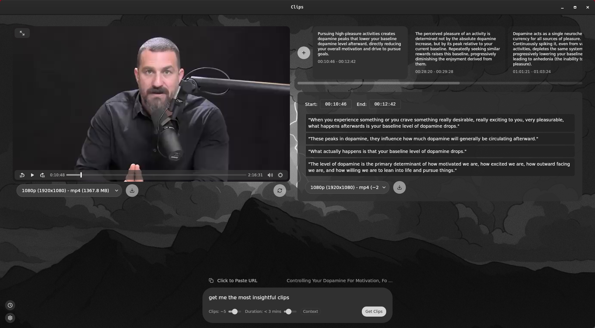
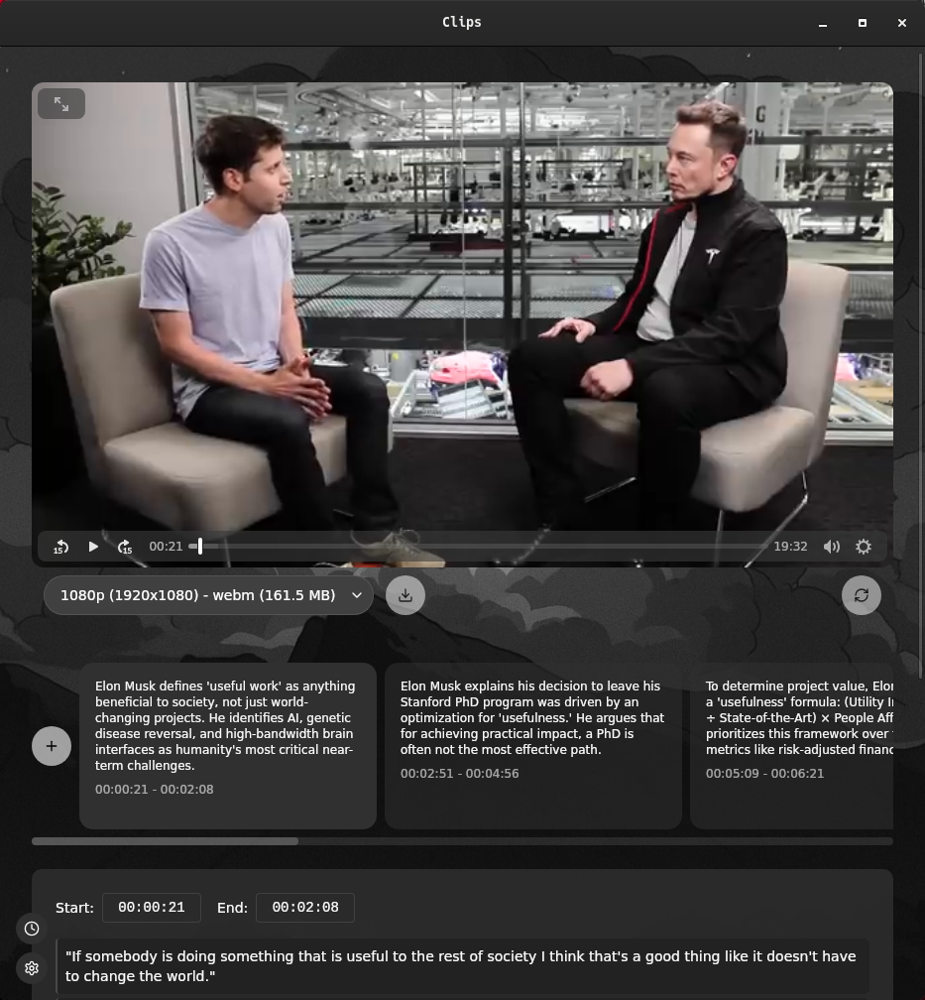

## 🎬 What is Clips?

I built **Clips** because I wanted to share interesting moments from YouTube videos on X (Twitter), but the process was tedious—watching, downloading, cropping, converting... too many steps.

**Clips** simplifies that. Just provide a prompt, and it automatically finds and generates clips from a YouTube video using AI. You can then easily download and share them wherever you want.

---

## ⚙️ Prerequisites

Before using Clips, make sure you have the following installed on your system:

- [yt-dlp](https://github.com/yt-dlp/yt-dlp/wiki/Installation)
- [ffmpeg](https://ffmpeg.org/download.html)

### Installation Commands

**macOS (Homebrew):**

```sh
brew install yt-dlp ffmpeg
```

**Windows (Chocolatey):**

```sh
choco install yt-dlp --pre -y
choco install ffmpeg -y
```

**Linux (GStreamer dependencies if playback fails):**

```sh
sudo apt install gstreamer1.0-libav gstreamer1.0-plugins-good \
  gstreamer1.0-plugins-bad gstreamer1.0-plugins-ugly \
  gstreamer1.0-alsa gstreamer1.0-pulseaudio
```

> 💡 For AI features to work, get a [Gemini API key](https://aistudio.google.com/apikey) and paste it into the app settings.

---

## 🖥️ Supported Platforms

| Status | Platform              | Download                                                                                                                                |
| ------ | --------------------- | --------------------------------------------------------------------------------------------------------------------------------------- |
| ✅     | Linux (.AppImage)     | [Download](https://github.com/0xmiki/clips/releases/download/v0.1.0/Clips_0.1.0_amd64.AppImage) – `Clips_0.1.0_amd64.AppImage` (101 MB) |
| ✅     | Linux (.deb)          | [Download](https://github.com/0xmiki/clips/releases/download/v0.1.0/Clips_0.1.0_amd64.deb) – `Clips_0.1.0_amd64.deb` (9.16 MB)          |
| ✅     | Linux (.rpm)          | [Download](https://github.com/0xmiki/clips/releases/download/v0.1.0/Clips-0.1.0-1.x86_64.rpm) – `Clips-0.1.0-1.x86_64.rpm` (9.16 MB)    |
| ✅     | Windows (.exe)        | [Download](https://github.com/0xmiki/clips/releases/download/v0.1.0/Clips_0.1.0_x64-setup.exe) – `Clips_0.1.0_x64-setup.exe` (6.21 MB)  |
| ✅     | Windows (.msi)        | [Download](https://github.com/0xmiki/clips/releases/download/v0.1.0/Clips_0.1.0_x64_en-US.msi) – `Clips_0.1.0_x64_en-US.msi` (7.62 MB)  |
| ⏳     | MacOS (Apple Silicon) | [Download](https://github.com/0xmiki/clips/releases/download/v0.1.0/Clips_0.1.0_aarch64.dmg) – `Clips_0.1.0_aarch64.dmg` (11.9 MB)      |
| ⏳     | MacOS (Intel)         | [Download](https://github.com/0xmiki/clips/releases/download/v0.1.0/Clips_0.1.0_x64.dmg) – `Clips_0.1.0_x64.dmg` (12 MB)                |
| ✅     | NixOS                 | [Setup Guide](https://github.com/0xmiki/clips/tree/main/nixos)                                                                          |

- ✅ Tested & working
- ⏳ Need people to test

---



